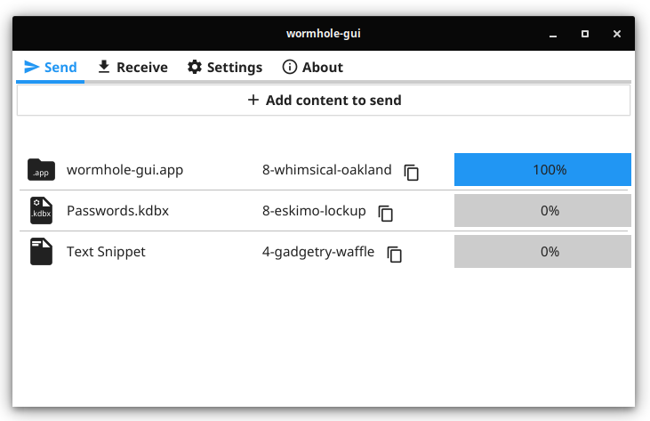

# wormhole-gui

Wormhole-gui is a cross-platform graphical interface for [magic-wormhole](https://github.com/magic-wormhole/magic-wormhole) that lets you easily share files, folders and text between computers on the local network.
It uses the Go implementation of magic-wormhole, called [wormhole-william](https://github.com/psanford/wormhole-william), and compiles statically into a single binary. Wormhole-gui is compatible with the cli applications from both [wormhole-william](https://github.com/psanford/wormhole-william) and [magic-wormhole](https://github.com/magic-wormhole/magic-wormhole).

<p align="center">
  
</p>

Built using the following Go modules:
- [fyne](https://github.com/fyne-io/fyne) (version 2.0.1)
- [wormhole-william](https://github.com/psanford/wormhole-william) (version 1.0.5)
- [compress](https://github.com/klauspost/compress) (version 1.11.7)

The initial version was built in less than one day to show how quick and easy it is to use [fyne](https://github.com/fyne-io/fyne) for developing applications.

## Sponsoring

Wormhole-gui an open source project that is provided free of charge and that will continue to be the case forever. If you use wormhole-gui and appreciate the work being put into it, please consider supporting the development through [GitHub Sponsors](https://github.com/sponsors/Jacalz). This is in now way a requirement, but would be greatly appreciated and would allow for even more improvements to come further down the road.

## Requirements

Wormhole-gui compiles into a statically linked binary with no runtime dependencies.
Compiling requires a [Go](https://golang.org) compiler (1.14 or later) and the [prerequisites for Fyne](https://developer.fyne.io/started/).

NOTE: Wormhole-gui can be built to run natively on Apple silicon (`darwin/arm64`, M1) when paired with Go 1.16 or later. However, release binaires not yet available, but regular `darwin/amd64` binaires should work through Rosetta 2 in the meantime.

## Downloads

Please visit the [release page](https://github.com/Jacalz/wormhole-gui/releases) for downloading the latest releases.
Versions for Linux (`x86-64` and `arm64`), FreeBSD, MacOS and Windows (`x86-64`) are available.

## Building

Systems with the compile-time requirements satisfied can build the project using `go build` in the project root:
```bash
go build 
```

The project can also be built and installed using GNU Make (installing is currently only supported on Linux and BSD):
```bash
make
sudo make install
```

## Contributing

Contributions are strongly appreciated. Everything from creating bug reports to contributing code will help the project a lot, so please feel free to help in any way, shape or form that you feel comfortable doing.

## License
- Wormhole-gui is licensed under `GNU GENERAL PUBLIC LICENSE Version 3`.
