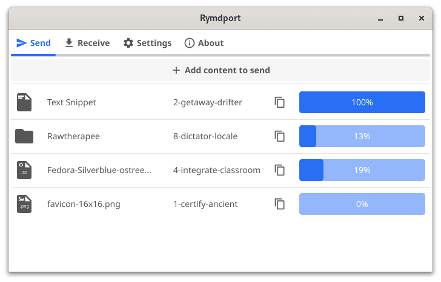

# Rymdport

[](https://github.com/Jacalz/rymdport/actions/workflows/tests.yml)
[](https://github.com/Jacalz/rymdport/actions/workflows/analysis.yml)
[](https://goreportcard.com/report/github.com/Jacalz/rymdport/v3)
[](https://github.com/Jacalz/rymdport/releases/latest)

Rymdport (formerly wormhole-gui) is a cross-platform application that lets you easily and safely share files, folders, and text between devices.
The data is sent securely with end-to-end encryption using the same protocol as [magic-wormhole](https://github.com/magic-wormhole/magic-wormhole). This means that Rymdport can talk not only to itself, but also to other wormhole clients.

The transfers are implemented using [wormhole-william](https://github.com/psanford/wormhole-william), a native [Go](https://go.dev/) implementation of magic-wormhole. As a result, Rymdport compiles into a native binary with no runtime dependencies while also outperforming the reference implementation of magic-wormhole.

<p align="center">
  
</p>

## Downloads

Please visit the [release page](https://github.com/Jacalz/rymdport/releases) to download the latest release.
Pre-built binaries are available for FreeBSD, Linux, macOS (`x86-64` and `arm64`) and Windows (`x86-64`).

For Linux users, Rymdport is also avaliable as a Flatpak on [Flathub](https://flathub.org/apps/details/io.github.jacalz.rymdport):

<a href='https://flathub.org/apps/details/io.github.jacalz.rymdport'></a>

The following distributions also have binary packages available through their respective package managers:

[](https://repology.org/project/rymdport/versions)

### Running on macOS arm64 (M1/M2)

Binaries that are not signed with an official Apple certificate and downloaded from the web are put into quarantine by macOS (Apple computers with Intel CPUs do not exhibit this behavior). To solve this, you need to remove the quarantine attribute from the application (replacing `<path to .app>` with the application path):
```
xattr -r -d com.apple.quarantine <path to .app>
```

If this does not work, the `amd64` binaries work fine through Rosetta.

## Requirements

Rymdport compiles into a statically linked binary with no explicit runtime dependencies.
Compiling requires a [Go](https://go.dev) compiler (version 1.17 or later are supported) and the [prerequisites for Fyne](https://developer.fyne.io/started/).

## Building

Systems with the compile-time requirements satisfied can build the project using `go build` in the project root:
```bash
go build
```

The project is available in the [Fyne Apps Listing](https://apps.fyne.io/apps/rymdport.html) and can be installed either using the `fyne get` command or using the [Fyne Apps Installer](https://apps.fyne.io/apps/io.fyne.apps.html).

Installation can also be performed using GNU Make (installing this way is currently only supported on Linux and BSD):
```bash
make
sudo make install
```

## Sponsoring

Rymdport is an open source project that is provided free of charge, and that will continue to be the case forever. If you use this project and appreciate the work being put into it, please consider supporting its development through [GitHub Sponsors](https://github.com/sponsors/Jacalz). This is in no way a requirement, but would be greatly appreciated and would allow for even more improvements to come further down the road.

## Contributing

Contributions are strongly appreciated. Everything from creating bug reports to contributing code will help the project a lot, so please feel free to help in any way, shape, or form that you feel comfortable with.

## Name

The word "rymdport" (pronounced `[rym:dpor‿t:]`) comes from the Swedish language and means "space gate".
As a wormhole is a kind of gateway through space, it became the new name after "wormhole-gui".

## License
- Rymdport is licensed under `GNU GENERAL PUBLIC LICENSE Version 3` and will forever continue to be open source.
